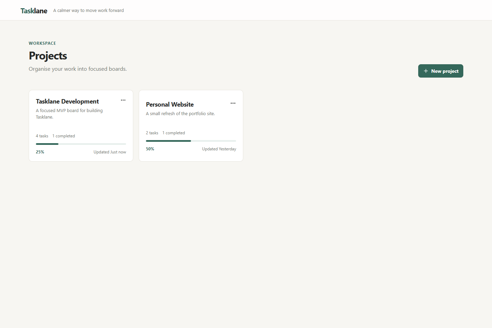
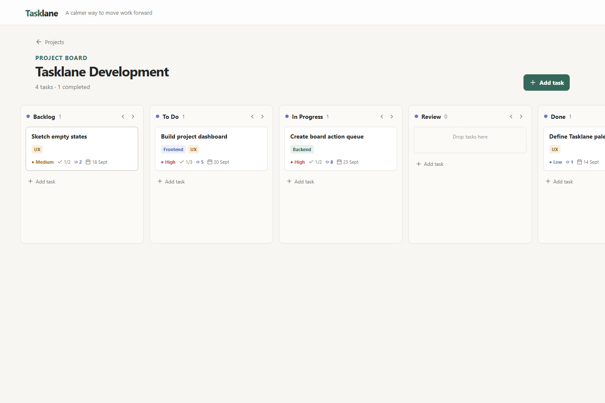

# Tasklane

Tasklane is a lightweight Kanban project manager focused on fast, visual task flow. A project owns an independent board with configurable columns, tasks, labels, checklists, priorities, story points, and due dates.

The MVP is deliberately small: no authentication, collaboration, notifications, or external integrations. The aim is a quiet, responsive product with Notion-like simplicity, lightweight Trello-style interaction, and durable task-movement processing.

## Planned stack

- Frontend: React, Vite, React Router, Tailwind CSS, shadcn/ui, Lucide, TanStack Query, and dnd-kit.
- Backend: FastAPI, SQLAlchemy 2.x, Pydantic, Alembic, and pytest.
- Database: SQLite by default for local development, configurable through `DATABASE_URL` for PostgreSQL.
- Runtime: Docker Compose for the frontend and backend.

## Core behaviour

- Create and browse projects at `/`.
- Open a board at `/projects/:projectId`.
- Configure project-specific workflow columns; task status is determined by its column, not by a fixed status enum.
- Create and edit tasks in a right-side drawer, including checklist items, labels, priority, points, and due dates.
- Move and reorder tasks and columns with immediate optimistic UI updates.
- Persist moves through a database-backed `BoardAction` queue before returning `202 Accepted`, so acknowledged work survives a backend restart.
- Use idempotency keys for movement commands and reconcile optimistic UI if an action fails.

## Repository layout

```text
tasklane/
├── frontend/              # React application
├── backend/               # FastAPI application and Alembic migrations
├── _docs/specs.md         # Product and technical specification
├── docker-compose.yml
├── .env.example
├── AGENTS.md
└── README.md
```

The current authoritative specification is [`_docs/specs.md`](_docs/specs.md). It defines the MVP scope, API surface, data model, visual direction, durable queue behaviour, and acceptance criteria.

## Frontend reference

The frontend currently uses a mocked service layer while the backend is intentionally deferred.

### Projects dashboard



### Kanban board



## Local development

Implementation scaffolding has not been added yet. Once it exists, the expected all-in-one local command is:

```bash
docker compose up --build
```

Use `.env.example` as the documented configuration template. Keep local credentials in an ignored `.env` file and configure the backend database with `DATABASE_URL`.

## Quality expectations

Backend coverage should include project, column, task, checklist, label, board-action/idempotency, recovery, retry, and deletion flows. Frontend coverage should test user-visible dashboard, board, drawer, checklist, optimistic-update, reconciliation, loading, and error behaviour. Test application behaviour rather than dnd-kit internals.

## MVP boundaries

Do not add authentication, users, collaboration, real-time updates, comments, attachments, notifications, integrations, dark mode, analytics, time tracking, advanced filtering, or automation unless a later GitHub issue explicitly expands the scope.

## Contributing

All work follows the GitHub issue and pull-request process in [AGENTS.md](AGENTS.md). Start from an issue, work in a dedicated branch, document the work on the issue, and raise a linked pull request for review.
